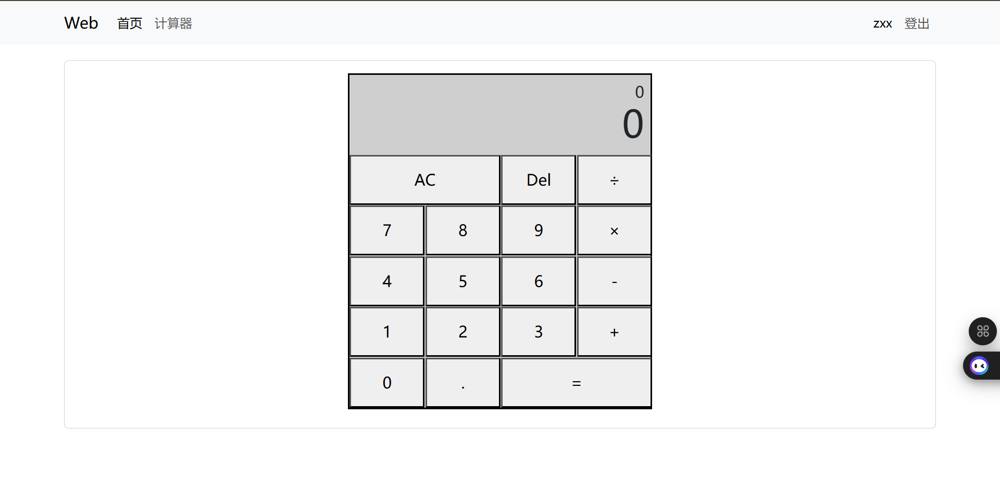

# 在线计算器项目

## 项目运行

```bash
npm install
npm start
```

运行后项目在`http://localhost:3000/`打开

## 项目描述

开发了一款基于 React 的在线计算器应用，支持用户登录、注册和基本数学运算功能。通过 Redux 管理全局状态，使用 React Router 实现页面导航，并集成 Bootstrap 提供响应式布局。

## 项目截图


